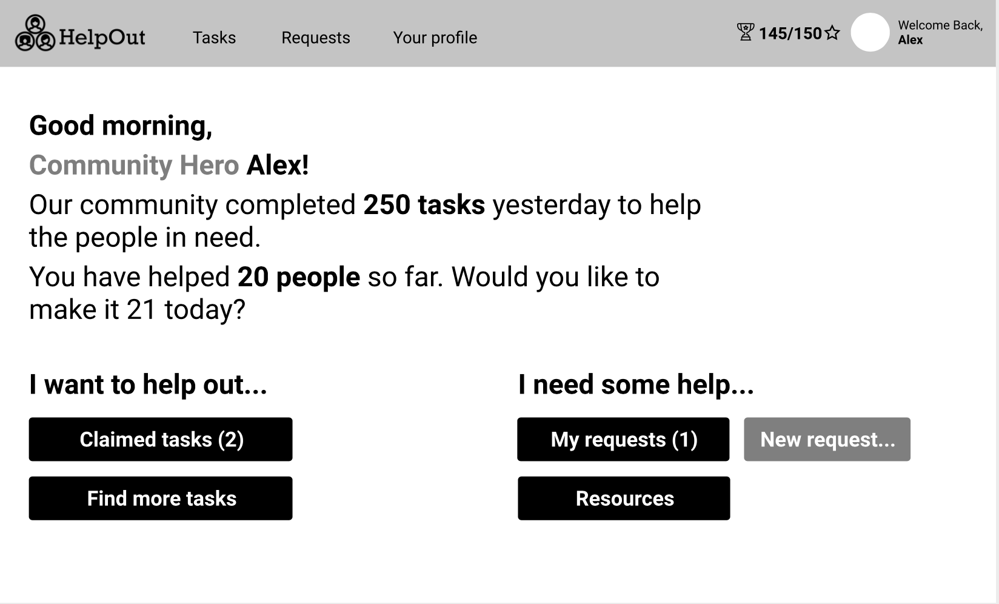
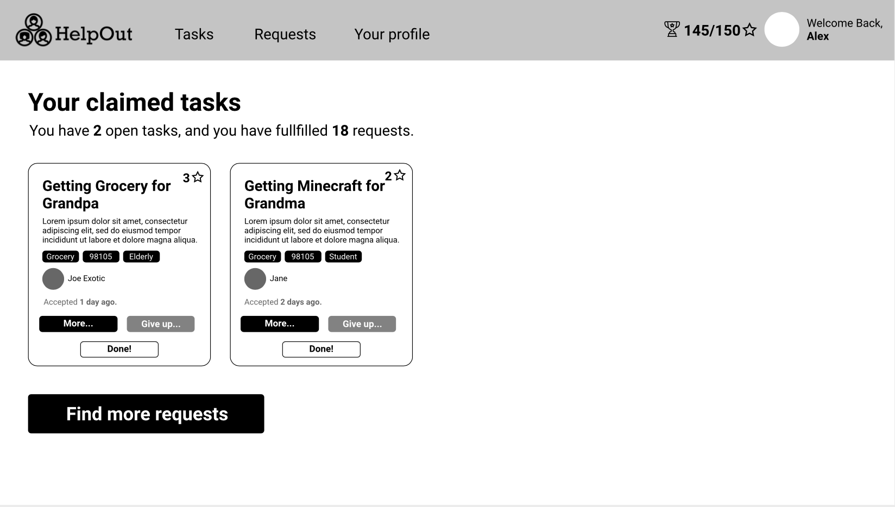
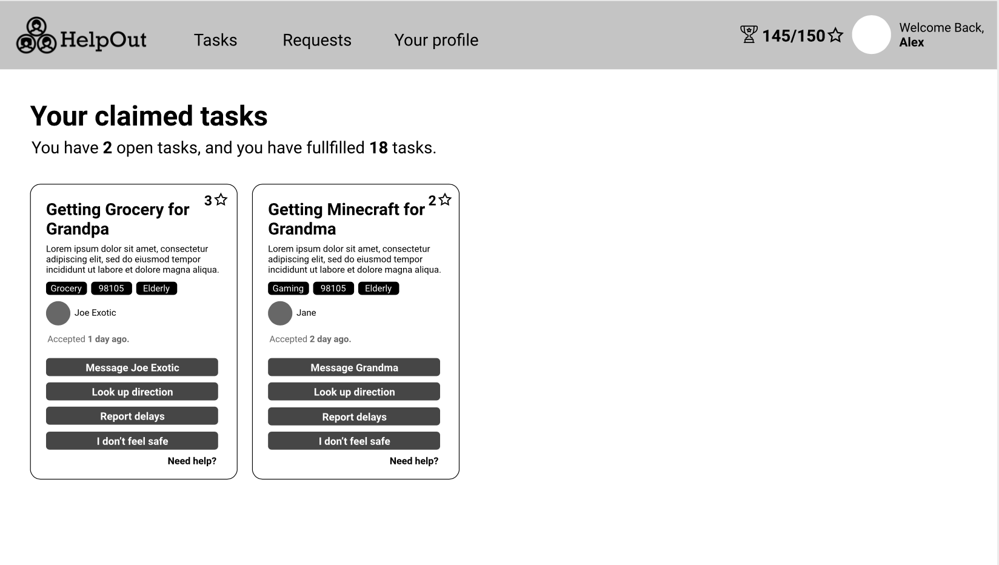
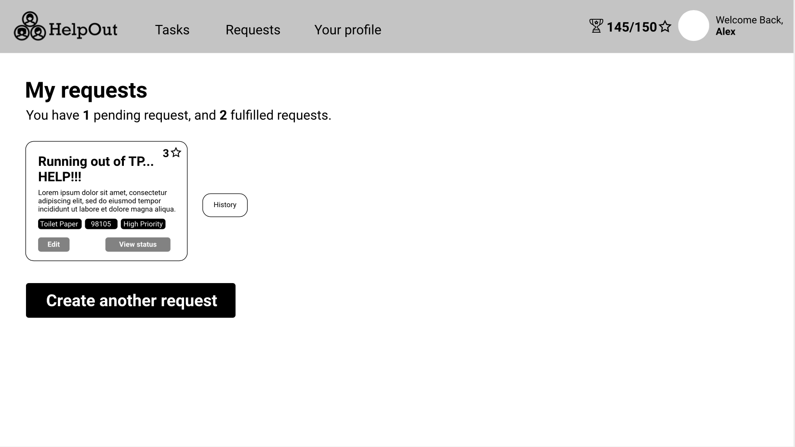
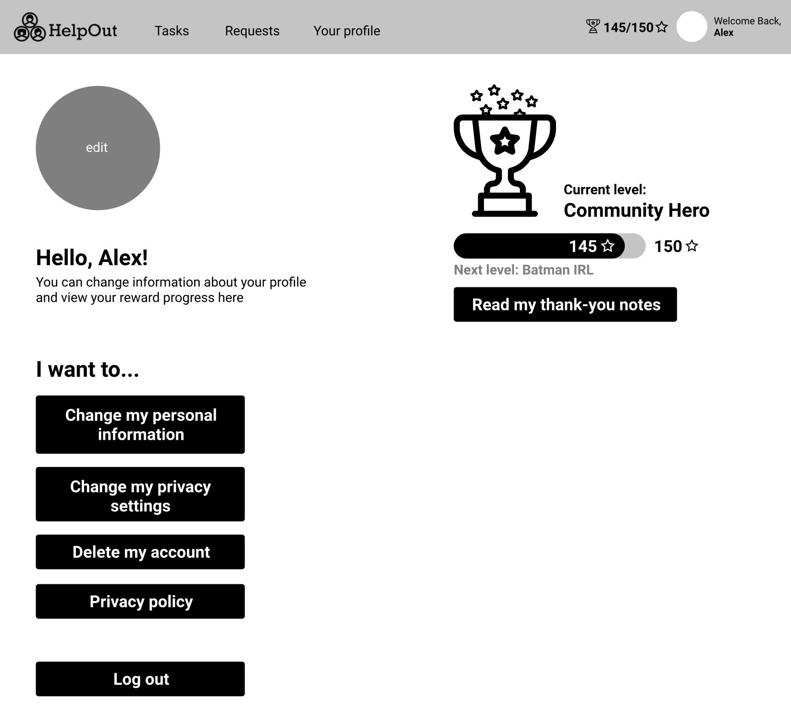
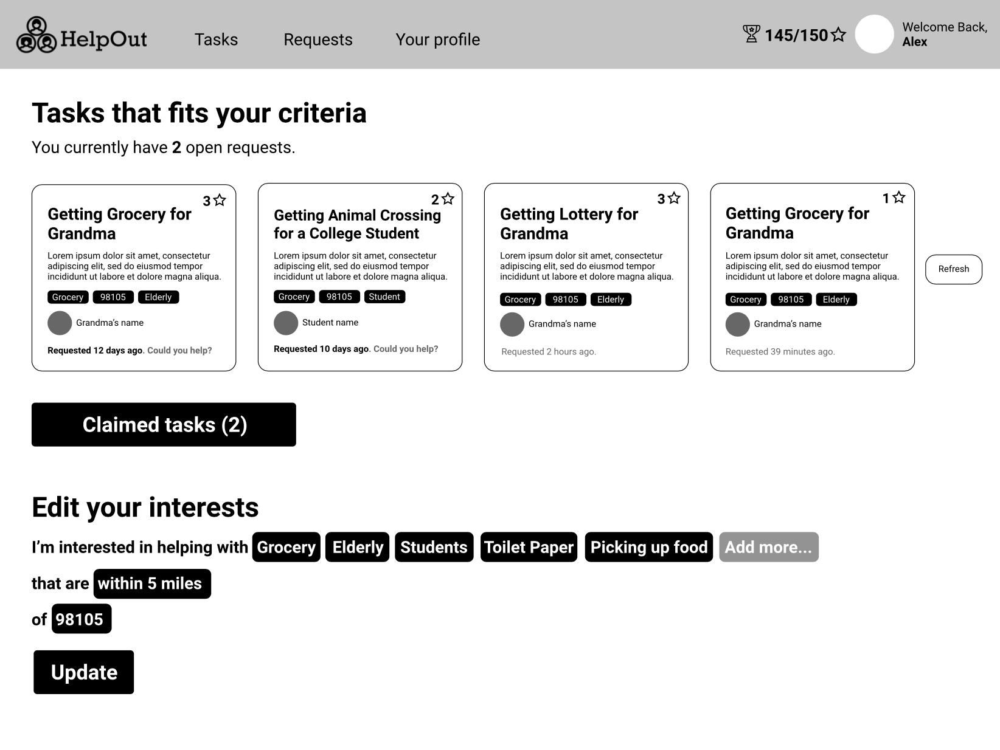
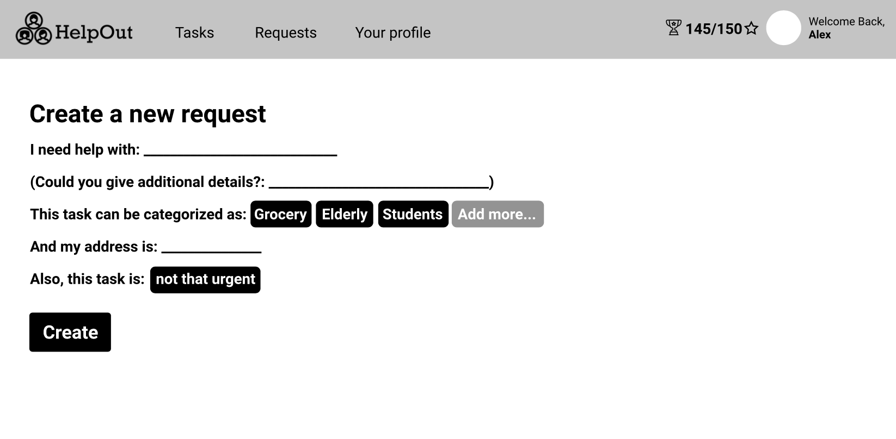
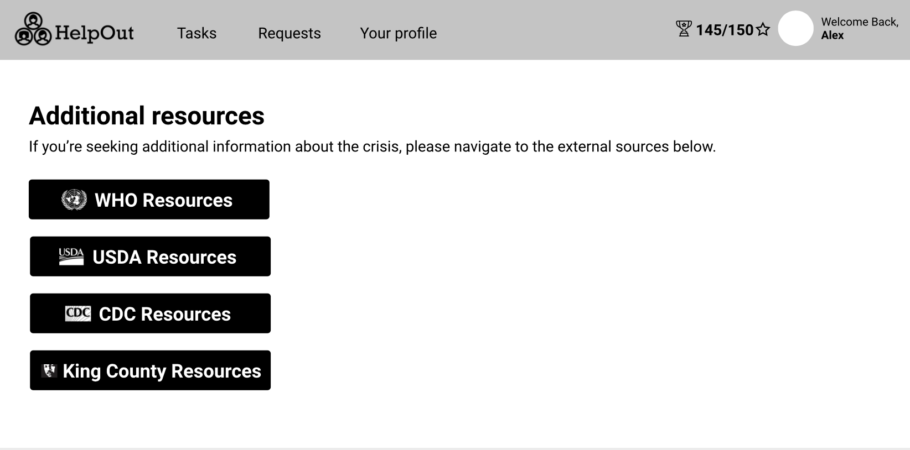
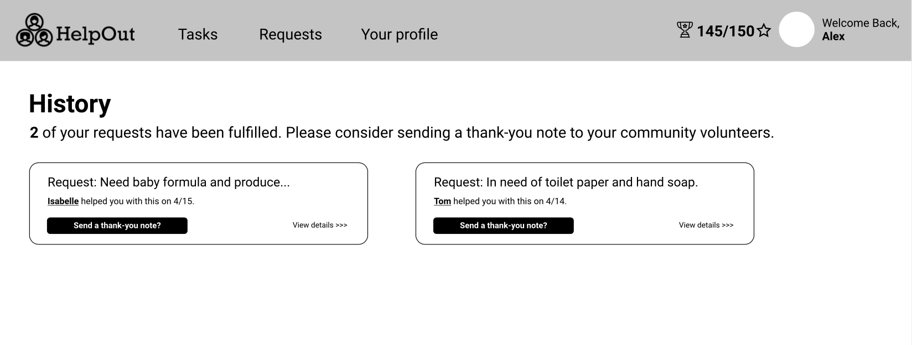
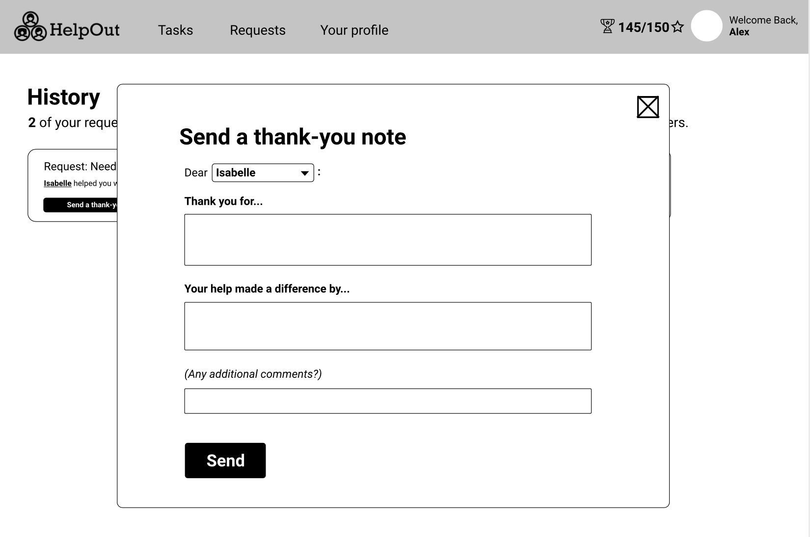

# Homework 2: Design Specification

## Problem Space
The unprecedented spread of the coronavirus has changed all lifestyles. To ‘flatten the curve’ of the COVID-19 pandemic, it is imperative that our society practices ‘social distancing’ - a practice requiring minimal contact with others. However, these required measures can separate communities and create barriers for those needing help the most during these times. People that need help may be facing new challenges as a result of this crisis, and their access to essential supplies may have changed as a result. Taking a trip to the grocery store may now be life-threatening for an immunocompromised individual, and a person’s new caregiving responsibilities may now limit both their financial autonomy and their ability to leave their house.
 
On the other hand, because of the unprecedented nature of this crisis, individuals that are willing to help those in need are often unsure of what they can do to make a difference. Opportunities to volunteer remotely are limited and often difficult to find, but the free time of many has increased as they stay at home. As a result, willing community volunteers are left feeling incapable of making a difference, and those in need are left feeling helpless. This illustrates the serious barriers that communities are facing to support one another in times when community support may be most important. 

## Our Proposed Solution
During such a crisis, it is imperative to bridge the gap between those who are in need of help and those who are willing to offer it. By appealing to the altruism of people in our community, we can create means of attaining necessary resources. Our solution, HelpOut, is a resource portal that allows anyone seeking help to request it, matching those requests to volunteers living in the same area who can fulfill them. With our web application, we hope to show that being apart does not mean a community cannot feel together. 

Our solution will have two core user groups - those volunteering to help and those seeking help. For those wanting to volunteer, we aim for this solution to be both intrinsically and extrinsically motivating for volunteers. Volunteers will feel intrinsically motivated to help for the good of the community, with daily community totals portrayed that will help remind the user of the good they are doing. However, we also feel that extrinsic rewards are important for many users, and have included incentivizing, point-based aspects to request fulfillment. Different requests are worth different amounts of stars, allocated to each request based on the date posted and urgency. Users can collect these stars, and will be given visible titles prefacing their names based on how many they have gained (i.e. ‘Community Hero’, ‘The Best Neighbor’). 

For those seeking help, we want this application to give them support with low-barriers to entry and a highly usable and accessible experience. The request-based interfaces are conversational and non-intimidating as a result, and the app overall has been simplified to have two navigation portals: one for each user that are easy to navigate to on the landing page. 

We have made it a point to use a simplistic design approach to accommodate for elderly users who might not be as technologically-savvy. We aim to have this portal as a go-to resource for members of the community during this crisis, appealing to the fundamental kindness and humanitarianism to uplift each other and stay connected as a community. 

### Screen Mock-Ups

#### Screen 1: The Personalized Dashboard (Home Screen) 

This is the first screen a user will arrive at after logging in. It’s a personalized dashboard showing information about their community’s completion of requests and their own task completion. It provides the main action items that our company offers users: either volunteering to claim tasks (requests put out by other members in the community) or creating new requests. Under the option to help out, there are two choices for the user. Selecting “Claimed Tasks” takes the user to Screen 2, where they can see the requests they’ve already claimed. “Find more tasks” takes them to Screen 6, where they can find new requests that have been made and are yet to be claimed by a volunteer. Under the second set of choices, users can choose to view the requests they’ve made to get help by clicking “My requests” on Screen 4. Selecting “New Request” leads them to Screen 7, where they can create a new request for someone to help out with. “Resources” will take them to Screen 8, where the user can access online resources that are helpful during the COVID-19 crisis. The navigation bar at the top of the screen is consistent among all the other pages as well. It allows for quick and easy access to all the different screens, as well as displaying the user’s accumulated points at the top. 

#### Screen 2: Claimed Tasks

This page displays the tasks the user has claimed to volunteer and help out with. It states a summarizing message at the top regarding the requests they have completed and how many tasks they have yet to finish. The card-view of the tasks allows for a quick summary of each request, providing all the necessary information at a glance. Each task has a title and a description right below. On the top right corner, the number of points that task is worth is displayed. Below the description, there are tags of the task that further describe it. Points are assigned to a task based on those tags. “More” expands the task card, taking the user to Screen 3. “Give up” removes the task from the queue, assuming the user has not been able to complete it. “Done” marks the task as complete, also removing it from the queue. 

#### Screen 3: Claimed Tasks (Expanded)

This page shows more actions for each claimed task that a user has committed to. Essentially, it is the same page as the screen before, but the tasks have been clicked on and this expanded to display more information and actions. Users can see how many tasks they need to complete and how many they have previously completed. By pressing the “Message” button, users navigate to another screen with the ability to view and send messages to the person they are helping. By pressing the “Lookup directions” button, Google Maps opens in a new tab with the address of the person they are helping. By pressing the “Report delays” button, a form appears on the screen with options describing several time frames for delays. By pressing the “I don’t feel safe” button, users are navigated to Screen 8 where they can view common safety problems, solutions, and resources to make sure users are practicing safety during a pandemic. Pressing “Need help?” navigates users to the help screen on the application where they have the ability to search our help resource with common issues and solutions.

#### Screen 4: Pending Requests

This page shows the requests that the user has posted. It shows a list of requests that are still yet to be completed by other volunteers and will keep the user updated if their requests are accepted by others. Users are also able to look up the status of the requests, allowing them to know if it has been claimed or not. Users can also look up their previous requests through the “History” panel. This page is also where they can create other requests, taking them to Screen 7, so the community can help them by clicking the “Create another request” button. They can also edit their requests on this page to change or add more information.

#### Screen 5: Personal Profile

This screen allows users to change their personal information as well as view their points progress. Information that the user could change includes personal information, a display picture, privacy settings, as well as viewing privacy policy and performing account level actions like deleting the account and logging out. They can also see their current level based on the points they’ve collected, as well as reading thank-you notes from people whom they have helped. It is intended to incentivize the experience and encourage people to perform more good deeds.

#### Screen 6: Matched Tasks

Users are able to select topics and demographics they are interested in. Requests for help are tailored to a users interest. The points for each request are displayed in the top right of each card, the amount of points corresponds to the urgency of the request as well as the amount of work it requires. Clicking on a task card expands the card showing more details and displays a button to add it to the user’s claimed tasks (as in Screen 3). Pressing the “Claimed tasks” button will display more cards underneath the button, showing the tasks a user has committed to fulfill. A user has the option to hide the claimed tasks with another button when they are being displayed. Pressing the “Refresh” button will replace the tasks with more tasks that fit the user’s interests. Users are able to click the buttons with current interests to remove them. Users press “Add more” to open up a menu where they are able to search and view additional options for interests. Pressing “Within 5 miles” opens a menu where users are able to input the mile radius they want to help. Pressing the area code button opens a menu where users can input their area code. Pressing the “Update” button confirms the changes a user has made.

#### Screen 7: Create New Request

This page allows users to post a new request. The user must enter text into the first field on what they need help with; this is typically a tweet-sized title of the request. A more descriptive version goes under the “Additional details” section. In the third field, the user clicks the “Add more…” button to add categories that describe their request. For the fourth field, the user’s address is entered through text. Note that this is not displayed until the task has been claimed. We will ensure appropriate security and privacy measures are taken. The last field allows a user to select a category for the level of urgency associated with their request. When the user has entered all information into each field, they can click the “Create” button to submit their request.

#### Screen 8: Additional Resources 

Additional Resources is a page that has links to other online resources that can help during the COVID-19 crisis. When the user clicks on one of the links, a new tab will open that will take them to the online resource listed on the link that they clicked. It can be accessed from the main dashboard. 

#### Screen 9: Request History

The “History” functionality allows the user to view their previous requests. When a user has submitted a request, they will be able to navigate to a History page from their “My Requests” page. The history serves as a way to remember those that had helped them, and give them recognition by sending them a message of thanks. Each history entry also has a “View details” link that will expand the entry box to show the description and tags of the request, as well as any chat logs that they had with the volunteer. If the user has not made any requests, none will be shown. 

#### Screen 10: Thank You Dialog Box 

The thank-you note feature serves as a way for the requester to express their gratitude in a guided form. This form appears in the form of a pop-up when the user clicks on the ‘Send a thank you note’ button under any history entry. The user can change the letter’s recipient in a drop-down menu of the volunteers that have helped them, and can navigate back to the history page by closing out of the pop-up in the box’s top-right corner. There are two text fields with prompts (“Thank you for…” and “Your help made a difference by...”), as well as a field for any additional comments. By having these fields rather than unguided text prompts, we aim to take user burden off of sending a message of thanks. Upon pressing the “Send” button, the message is sent to the volunteer’s inbox and the user is brought back to their history page. 
