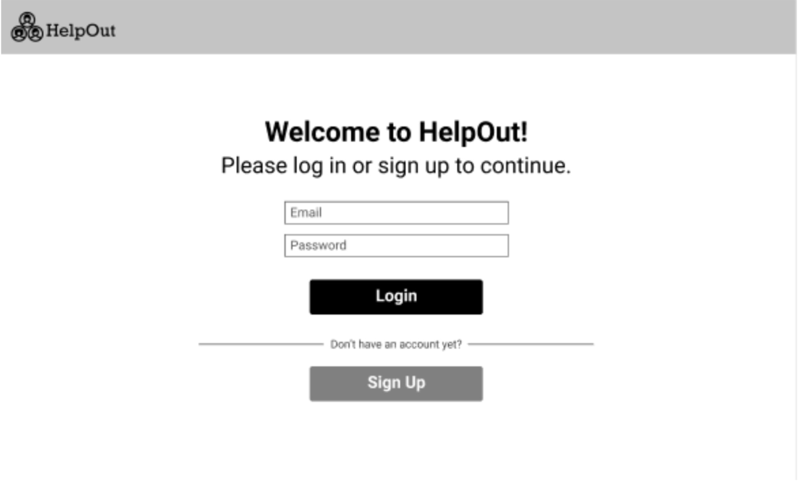
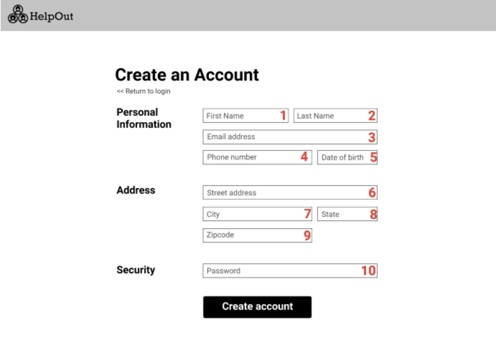

# Homework 3: Requirements Documentation
### Below are our requirements for developing our web application, HelpOut. The requirements are listed according to each screen we have in our application. 

#### Screen 1: User Login

The login or sign up page is what a new or logged out user will see first upon visiting our web application. Stylization should be in accordance with what is shown in the above wireframe, Screen 1.

a) Users should be able to click on the ‘Email’ or ‘Password’ boxes to enter text.

b) When a text box is clicked on, the placeholder text will disappear and user-entered text will appear in its place. 

c) When the user clicks the ‘Login’ button, the text they inputted in the ‘Email’ and ‘Password’ fields will be verified as follows:
  - The text inputted in the ‘Email’ box will be checked for an exact, non-case-sensitive character match to user.user_email in the database. 
  - The password inputted in the ‘Password’ box will be checked for an exact, case-sensitive match to user.password in the database. 

d) If the email and password combination do not match a combination stored in the database the error message ‘Your email and/or password are incorrect.’ will be displayed directly above the Login button, and the user will stay on the same page. 

e) If the email and password match a combination stored in the database, as detailed in requirement (1c.), the user clicking on the ‘Login’ button will navigate the user to their home page [Screen 3].

f) Clicking on the ‘Sign Up’ button will navigate the user to the Create Account page [Screen 2]. 

#### Screen 2: Create Account

The create account page allows users to create a new account to join the site once they correctly and completely entire the required information. Stylization should be in accordance with what is shown in the above wireframe, Screen 2.

a) Users should be able to click on the ‘<< Return to login’ text directly underneath the title to be navigated back to the Login Page [Screen 1]. 

b) Users should be able to click on any text box [labeled above 1-10] and be able to input text.

c) The system must check for correct formatting as follows:

  - The ‘Phone number’ field (4) must only accept integer values by not permitting any non-integer character to be typed and displayed.
  - The ‘Date of birth’ field must be in the format [dd/mm/YY]. 
  - The ‘State’ field must only permit users to type in two non-numeric characters (denoting state abbreviation.
  - The ‘Zipcode’ field must only allow for 5 integer character inputs.
  
d) If not enough characters are inputted in the fields from requirement (2c), the text box must show a red border and display a red error message directly above it.
  
   - The ‘Phone number’ field (4) must have the error message: “Please insert your phone number in the following format: 206-123-4567.” 
  - The ‘Date of birth’ field must have the error message: “Please insert your date of birth in the following format: mm/dd/YY.” 
  - The ‘State’ field must have the error message: “Please insert your state’s abbreviated name in the following format: XX. (i.e. NY for New York).” 
  - The ‘Zipcode’ field must have the error message: “Please insert your zipcode in the following format: 12345, using only numbers.” 

e) The user must not be able to create an account (i.e. no data should be sent to the database) unless all fields are filled in and they are in the correct format, as detailed in requirement (2d). 

  - If any field does not contain text when the “Create account” button is pressed, the borders of the incomplete boxes must turn red, and an error message must display inside the box.
  - The error message must be displayed to the user as follows:
    - Red text, and the same size and font as the original placeholder text.
    - It must be formatted as such: “[The field’s original placeholder text] is a required field.” (i.e. City is a required field.)
    
f) Clicking on the ‘Create account’ button will populate the inputted text fields in the database table USER as follows:

  - Field (1) will go into USER_FNAME. 
  - Field (2) will go into USER_LNAME.
  - Field (3) will go into USER_EMAIL.
  - Field (4) will go into USER_PHONE_NUMBER.
  - Field (5) will go into USER_DOB.
  - Field (6) will go into USER_STREET_ADDRESS.
  - Field (7) will go into USER_CITY.
  - Field (8) will go into USER_STATE.
  - Field (9) will go into USER_ZIP_CODE.

g) Upon successful creation of an account (meeting requirements from 2b), the system will generate and send to the database table USER a new USER_ID. 

  -  The USER_ID must be a randomly generated, globally unique identifier 64 bit Integer. 
  - A ‘global unique identifier’ means that the ID must not match any other USER_ID in the USER database table. 
  
#### Screen 3: Homepage
The Homepage serves as a dashboard with navigation to all the possible actions the user can take. It also provides a summary of the user’s completed tasks, as well as the community’s. Stylization should be in accordance with what is shown in the above wireframe, Screen 3.

a) At the very top of the page is a horizontal navigation bar, henceforth referred to as the navbar (A).

  - At the very left of the navbar will be the HelpOut logo (I).
  - To the right of the logo on the navbar will be a clickable menu item called ‘Tasks’ (II). Clicking on this will take the user to Screen 4. 
  - To the right of the ‘Tasks’ menu item on the navbar will be another clickable menu item called ‘Requests’. Clicking on this will take the user to Screen 7. 
  - To the extreme right side of the navbar will be a circular frame with the user’s image (blank circle if they choose to not upload anything), paired with the text “Welcome back, [user’s first name] (IV). 
    - The first name will be taken from the USER_FNAME column under the USER table in the database. 

b) Directly below the navbar, in an H2 heading, will be a greeting. The format will be “Good morning, [user’s first name] (V). 

  - The first name will be taken from the USER_FNAME column under the USER table in the database. 
  
c) Below the heading, in regular text, information on the total tasks completed by the community and user will be displayed.

  - First, the community’s tasks will be written in this format: “Our community completed X tasks yesterday to help the people in need.” (VI).
    - X is a positive integer and will be a calculated field: a sum of all the TASK_IDs where TASK_STATUS = “Complete” from the CLAIMED_TASK table.
  - Second, the user’s tasks will be written in this format: “You have helped X people so far. Would you like to make it X+1 today?” (VII).
    - X is a positive integer and will be a calculated field: a sum of all the TASK_IDs where TASK_STATUS = “Complete” and the USER_ID corresponds to that of the logged-in user from the CLAIMED_TASK table. 
    - X+1 is a simple calculation: adding one to the previously calculated X and displaying the result.

d) Below the displayed information will be two main action items. Directly below the information will be an H2 heading that reads “I want to help out…”. (VIII).

e) Beneath that H2 heading will be two buttons listed vertically:

  - The first button will read ‘Claimed Tasks (X)’ where X (a positive integer) is a calculated field showing the total number of tasks the user has already claimed (i.e., the sum of the TASK_IDs where the USER_ID matches that of the logged-in user, and STATUS = “Incomplete” from the table CLAIMED_TASKS.
    - When clicked, this button will take the user to Screen 4.
  - The second button, right below the first, will read ‘Find more tasks’. When clicked, this button will take the user to Screen 6. 

f) To the right of the “I want to help out…” heading, splitting the page evenly, will be another H2 heading that reads “I need some help with…” (IX). 

g) Beneath that H2 heading will be three buttons listed as shown in Screen 3. 

  - The first button will read “My requests (X)” where X (a positive integer) is a calculated field showing the total number of requests made by the user (i.e., the sum of REQUEST_IDs where the USER_ID matches that of the logged-in user from the table REQUESTS). 
  - The second button, to the right of the first, will read “New request…”.
    - When clicked, this will navigate the user to Screen 9. 
  - The third button, directly beneath the first, will read “Resources”.
    - When clicked, this will take the user to Screen 11. 

