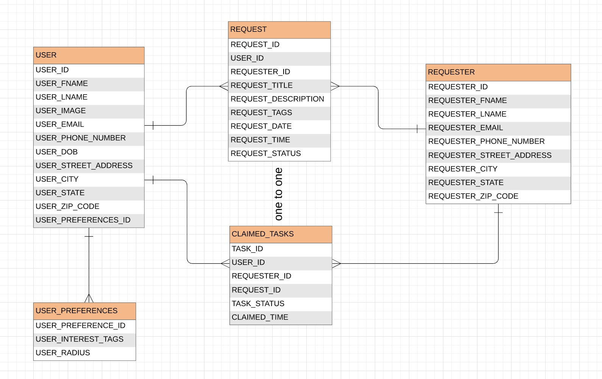

# Homework 3: Requirements Documentation
### Below are our requirements for developing our web application, HelpOut. The requirements are listed according to each screen we have in our application. 

#### Screen 1: User Login
The login or sign up page is what a new or logged out user will see first upon visiting our web application. COMPLETE

a) Users should be able to click on the ‘Email’ or ‘Password’ boxes to enter text. COMPLETE

b) When a text box is clicked on, the placeholder text will disappear and user-entered text will appear in its place. COMPLETE

c) When the user clicks the ‘Login’ button, the text they inputted in the ‘Email’ and ‘Password’ fields will be verified as follows: COMPLETE
  - The text inputted in the ‘Email’ box will be checked for an exact, non-case-sensitive character match to user.user_email in the database. COMPLETE
  - The password inputted in the ‘Password’ box will be checked for an exact, case-sensitive match to user.password in the database. COMPLETE

d) If the email and password combination do not match a combination stored in the database the error message ‘Your email and/or password are incorrect.’ will be displayed directly above the Login button, and the user will stay on the same page. COMPLETE

e) If the email and password match a combination stored in the database, as detailed in requirement (1c.), the user clicking on the ‘Login’ button will navigate the user to their home page [Screen 3]. COMPLETE

f) Clicking on the ‘Sign Up’ button will navigate the user to the Create Account page [Screen 2]. COMPLETE

#### Screen 2: Create Account
The create account page allows users to create a new account to join the site once they correctly and completely entire the required information. COMPLETE

a) Users should be able to click on the ‘<< Return to login’ text directly underneath the title to be navigated back to the Login Page [Screen 1]. COMPLETE

b) Users should be able to click on any text box and be able to input text. COMPLETE

c) The system must check for correct formatting as follows: COMPLETE

  - The ‘Phone number’ field must only accept integer values by not permitting any non-integer character to be typed and displayed.
  - The ‘Date of birth’ field must be in the format [dd/mm/YY]. 
  - The ‘State’ field must only permit users to type in two non-numeric characters (denoting state abbreviation.
  - The ‘Zipcode’ field must only allow for 5 integer character inputs.
  
d) If not enough characters are inputted in the fields from requirement (2c), the text box must show a red border and display a red error message directly above it. COMPLETE
  
   - The ‘Phone number’ field must have the error message: “Please insert your phone number in the following format: 206-123-4567.” 
  - The ‘Date of birth’ field must have the error message: “Please insert your date of birth in the following format: mm/dd/YY.” 
  - The ‘State’ field must have the error message: “Please insert your state’s abbreviated name in the following format: XX. (i.e. NY for New York).” 
  - The ‘Zipcode’ field must have the error message: “Please insert your zipcode in the following format: 12345, using only numbers.” 

e) The user must not be able to create an account (i.e. no data should be sent to the database) unless all fields are filled in and they are in the correct format, as detailed in requirement. COMPLETE

  - If any field does not contain text when the “Create account” button is pressed, the borders of the incomplete boxes must turn red, and an error message must display inside the box. COMPLETE
  - The error message must be displayed to the user as follows:
    - Red text, and the same size and font as the original placeholder text.
    - It must be formatted as such: “[The field’s original placeholder text] is a required field.” (i.e. City is a required field.)
    
f) Clicking on the ‘Create account’ button will populate the inputted text fields in the database table USER as follows:

  - Field (1) will go into USER_FNAME. 
  - Field (2) will go into USER_LNAME.
  - Field (3) will go into USER_EMAIL.
  - Field (4) will go into USER_PHONE_NUMBER.
  - Field (5) will go into USER_DOB.
  - Field (6) will go into USER_STREET_ADDRESS.
  - Field (7) will go into USER_CITY.
  - Field (8) will go into USER_STATE.
  - Field (9) will go into USER_ZIP_CODE.
  COMPLETE

g) Upon successful creation of an account (meeting requirements from 2b), the system will generate and send to the database table USER a new USER_ID. COMPLETE

  -  The USER_ID must be a randomly generated, globally unique identifier 64 bit Integer. COMPLETE
  - A ‘global unique identifier’ means that the ID must not match any other USER_ID in the USER database table. 
  
#### Screen 3: Homepage
The Homepage serves as a dashboard with navigation to all the possible actions the user can take. It also provides a summary of the user’s completed tasks, as well as the community’s. COMPLETE

a) At the very top of the page is a horizontal navigation bar, henceforth referred to as the navbar. COMPLETE

  - At the very left of the navbar will be the HelpOut logo. Clicking on this will take the user to the Homepage from any other screen on the app. COMPLETE
  - To the right of the logo on the navbar will be a clickable menu item called ‘Tasks’. Clicking on this will take the user to Screen 4. This menu item has a drop down with two options, 'My claimed tasks' and 'Find new tasks'. COMPLETE
  - To the right of the ‘Tasks’ menu item on the navbar will be another clickable menu item called ‘Requests’. Clicking on this will take the user to Screen 7. This menu item has a drop down with two options, 'My requests' and 'Create new request'. COMPLETE
  - To the extreme right side of the navbar will the text “Welcome back!". This menu item has a drop down with the option to log out of the system. COMPLETE

b) Directly below the navbar, in an H2 heading, will be a greeting. The format will be “Hello [user’s first name]. COMPLETE

  - The first name will be taken from the USER_FNAME column under the USER table in the database. COMPLETE
  
c) Below the heading, in regular text, information on the total tasks completed by the community and user will be displayed. COMPLETE

  - First, the community’s tasks will be written in this format: “Our community completed X task(s) so far to help the people in need.” COMPLETE
    - X is a positive integer and will be a calculated field: a sum of all the TASK_IDs where TASK_STATUS = “Complete” from the CLAIMED_TASK table. COMPLETE
  - Second, the user’s tasks will be written in this format: “You have helped X people so far. Would you like to make it X+1 today?”. COMPLETE
    - X is a positive integer and will be a calculated field: a sum of all the TASK_IDs where TASK_STATUS = “Complete” and the USER_ID corresponds to that of the logged-in user from the CLAIMED_TASK table. COMPLETE
    - X+1 is a simple calculation: adding one to the previously calculated X and displaying the result. COMPLETE

d) Below the displayed information will be two main action items. Directly below the information will be an H2 heading that reads “I want to help out…”. COMPLETE

e) Beneath that H2 heading will be two buttons listed vertically: COMPLETE

  - The first button will read ‘Claimed Tasks'. 
    - When clicked, this button will take the user to Screen 4.
  - The second button, right below the first, will read ‘Find more tasks’. When clicked, this button will take the user to Screen 6. 

f) To the right of the “I want to help out…” heading, splitting the page evenly, will be another H2 heading that reads “I need some help with…”. COMPLETE

g) Beneath that H2 heading will be three buttons listed as shown in Screen 3. COMPLETE

  - The first button will read “My requests"
  - The second button, to the right of the first, will read “New request”.
    - When clicked, this will navigate the user to Screen 9. 
  - The third button, directly beneath the first, will read “Resources”.
    - When clicked, this will take the user to Screen 11. 

#### Screen 4: Claimed Tasks
The Claimed Tasks page lets users view the list of tasks they have committed to completing. COMPLETE

a) Directly below the navigation bar, there will be the H2 header “Claimed Tasks”. COMPLETE

b) Directly below the header, a message will be displayed that reads "Below are your claimed tasks. If there are no tasks below, it means you have not yet claimed a request. Click on the button below to find new tasks!" COMPLETE
 
c) Open tasks will be displayed as a list of cards. COMPLETE
  
d) Each card for an open task will include the following, listed vertically in the following order and styled as in Screen 4:

  - An H4 title retrieved from the database at REQUEST_TITLE from the REQUEST table. COMPLETE
  - As much as three lines of text can fit the description retrieved from the database at REQUEST_DESCRIPTION from the REQUEST table. COMPLETE
  - The name retrieved from the database, looking at the user associated with the claimed task using the USER_FNAME, USER_LNAME, AND USER_IMAGE from the USER table. COMPLETE
  - The time the task was claimed, displaying the CLAIMED_TIME from the   - CLAIMED_TASKS table in the database. COMPLETE
  - There will be three buttons listed, two next to each other and one below:
    - An X button that allows the user to give up on the task when clicked will make the card disappear and remove the task from the CLAIMED_TASKS table, changing the REQUEST_STATUS to 'unclaimed' and changing the USER_ID to null. COMPLETE
    - A button with an information symbol, when clicked will replace the buttons with the phone number and address of the requester. COMPLETE
    - A button with a green check mark, when clicked will access the database to change the TASK_STATUS from the CLAIMED_TASKS table to equal “Complete” and make the task card disappear from the screen view. COMPLETE
 
d) Below the list of cards is a button with the text “Find new tasks” when clicked will navigate the user to Screen 6.COMPLETE

#### Screen 6: Suggested Tasks
On the Suggested Tasks page, users can view tasks that other users have requested. COMPLETE

a) Directly below the navigation bar, there will be the H2 header “Tasks in My Area (USER_ZIP_CODE)” with the zip code taken from the USER table. COMPLETE

b) Directly below the title will be displayed a message that reads: "Below are requests in your zipcode! If there are no cards shown, all requests in your area have been fulfilled. Try a different zip code to find new requests." COMPLETE

c) Below the header will be a text field for the user to input a different zip code if they wish, thus filtering the options of requests that appear. COMPLETE

d) There will be a list of open request cards, each card including the following:

  - Please refer to Screen 6 for details on the card view. 
  - An H4 title retrieved from the database at REQUEST_TITLE from the REQUEST table.
  - As much as three lines of text can fit the description retrieved from the database at REQUEST_DESCRIPTION from the REQUEST table.
  - The name retrieved from the database, looking at the user associated with the claimed task using the USER_FNAME, USER_LNAME, USER_IMAGE fields from the USER table.
  - The time the request was made.
  
  e) The tasks displayed in the list of open request cards will be retrieved from the database looking at 4 open requests (REQUEST_STATUS) from the REQUEST table that match the zip code of the user (or the zip code specified).

  - Upon refreshing the page, the list of request cards to be reselected from the database with the new updates to the database and text fields on screen.

#### Screen 7: My Requests
The My Requests page displays the request cards made by the user. COMPLETE

a) Directly below the navigation bar, there will be the H2 header “My requests”. COMPLETE

b) Directly below the header, a message will be displayed that reads "Below are the requests you have made. If there are no request cards displayed, then you have not yet made a request. Click on the button below to create your request!" COMPLETE
  
b) Request cards will be listed horizontally. COMPLETE

c) Above the list of cards will be a button that reads "Create Request",  navigating the user to Screen 9. COMPLETE

#### Screen 8: Account Options Drop-Down
This page shows the options available when the user clicks on their name on the top right corner of the navigation bar. COMPLETE

a) When the user clicks on the ‘Welcome back’ field, a box should pop-up underneath the text, beneath the navbar. COMPLETE

b) There must be one button in the drop-down box: COMPLETE

  - The user should be able to log out of their account by clicking on the ‘Log out’ button in the drop-down box. 
    - Upon clicking this, the user will be navigated to the Log-in / Sign-up screen [see Screen 1.] This is the only screen a non-logged in user will see. COMPLETE
    - The user must input their email and password to sign back into their account. COMPLETE
    
#### Screen 9 and 10: Create a New Request + Drop-Down/Submitted
On this page, users will be able to add a new request. COMPLETE

a) Directly below the navigation bar, there will be the H2 header “Create a new request”. COMPLETE

b) Below the header, there will be 5 fields for the user to fill out, listed vertically):	COMPLETE

  - Field 1: Will have the text “I need help with:” followed by an entry field for the user to add text. 
  - Field 2: Will have the text “Could you give additional details?:” followed by an entry field for the user to add text. This field will be wrapped in parentheses. 
    - Field 4: Will have the text “My address is:” followed by an entry fields for Street Address, City, State” for the user to add text. 
    - Field 5: Will have the text “Zipcode:” followed by an entry field for the user to add text. 
    
  - There will be a button labeled “Submit” below the fields. When clicked, the data in the following fields will be submitted to the database table REQUEST. COMPLETE
    - Field 1 will go into REQUEST_TITLE
    - Field 2 will go into REQUEST_DESCRIPTION
    - Field 4 will go into REQUEST_ADDRESS
    - Field 5 will go into REQUEST_ZIP_CODE
    - The data in the following fields will be submitted to the database table REQUESTER:
    - Field 4 will go into REQUESTER_STREET_ADDRESS, REQUESTER_CITY, REQUESTER_STATE, respectively
    - Field 2 will go into REQUEST_DESCRIPTION
    - Field 4 will go into REQUEST_ADDRESS
    - Field 5 will go into REQUEST_ZIP_CODE
   
  - Additionally, the time the request was made and the user who made it will also be submitted to the database table REQUEST: COMPLETE
    - The time of the request will be in UTC and will go into REQUEST.TIME in the format 'YYYY-MM-DD hh: mm: ss' COMPLETE
    - The user id of the user who made a request will go into REQUESTER.ID. COMPLETE

  - After the user clicks the "Submit" button, a popup will appear indicating that request has been submitted. It will contain the text “Submit Successful” with a button labeled “done” below this text. COMPLETE
    - Upon clicking "done", the user should return to the Requests page. COMPLETE

#### Screen 11: Additional Resources
On this page, users can find additional resources to help during the COVID-19 crisis. COMPLETE

a) Directly below the navigation bar, there will be an H2 header “Additional Resources”. COMPLETE

b) Below this header will be the text “If you’re seeking additional information about the crisis, please navigate to the external sources below.”. COMPLETE

c) Below the text, there will be links to the following websites listed vertically in buttons: COMPLETE

  - https://www.who.int/health-topics/coronavirus#tab=tab_1
    - Button should be labeled “WHO Resources”
  - https://www.usda.gov/coronavirus
    - Button should be labeled USDA Resources 
  - https://www.cdc.gov/coronavirus/2019-ncov/index.html
    - Button should be labeled CDC Resources 
  - https://kingcounty.gov/depts/health/communicable-diseases/disease-control/novel-coronavirus.aspx
    - Button should be labeled King County Resources 

### OUR ERD

