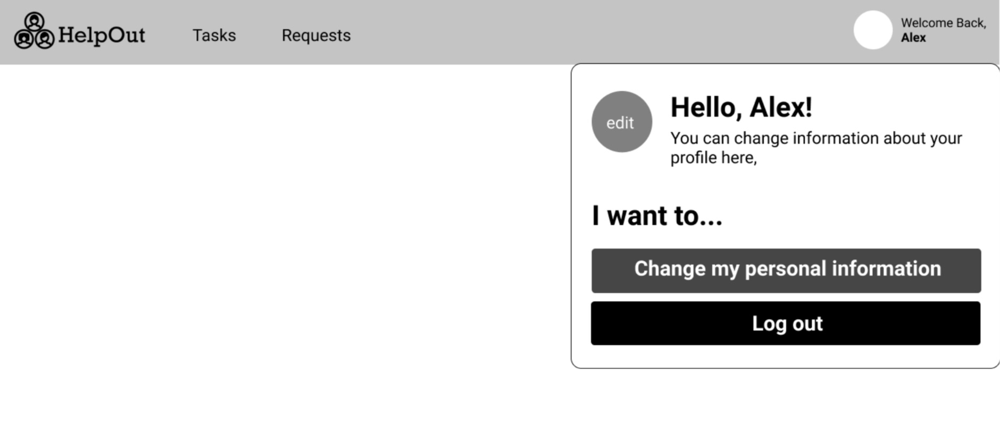

# Homework 3: Requirements Documentation
### Below are our requirements for developing our web application, HelpOut. The requirements are listed according to each screen we have in our application. 

#### Screen 1: User Login

The login or sign up page is what a new or logged out user will see first upon visiting our web application. Stylization should be in accordance with what is shown in the above wireframe, Screen 1.

a) Users should be able to click on the ‘Email’ or ‘Password’ boxes to enter text.

b) When a text box is clicked on, the placeholder text will disappear and user-entered text will appear in its place. 

c) When the user clicks the ‘Login’ button, the text they inputted in the ‘Email’ and ‘Password’ fields will be verified as follows:
  - The text inputted in the ‘Email’ box will be checked for an exact, non-case-sensitive character match to user.user_email in the database. 
  - The password inputted in the ‘Password’ box will be checked for an exact, case-sensitive match to user.password in the database. 

d) If the email and password combination do not match a combination stored in the database the error message ‘Your email and/or password are incorrect.’ will be displayed directly above the Login button, and the user will stay on the same page. 

e) If the email and password match a combination stored in the database, as detailed in requirement (1c.), the user clicking on the ‘Login’ button will navigate the user to their home page [Screen 3].

f) Clicking on the ‘Sign Up’ button will navigate the user to the Create Account page [Screen 2]. 

#### Screen 2: Create Account

The create account page allows users to create a new account to join the site once they correctly and completely entire the required information. Stylization should be in accordance with what is shown in the above wireframe, Screen 2.

a) Users should be able to click on the ‘<< Return to login’ text directly underneath the title to be navigated back to the Login Page [Screen 1]. 

b) Users should be able to click on any text box [labeled above 1-10] and be able to input text.

c) The system must check for correct formatting as follows:

  - The ‘Phone number’ field (4) must only accept integer values by not permitting any non-integer character to be typed and displayed.
  - The ‘Date of birth’ field must be in the format [dd/mm/YY]. 
  - The ‘State’ field must only permit users to type in two non-numeric characters (denoting state abbreviation.
  - The ‘Zipcode’ field must only allow for 5 integer character inputs.
  
d) If not enough characters are inputted in the fields from requirement (2c), the text box must show a red border and display a red error message directly above it.
  
   - The ‘Phone number’ field (4) must have the error message: “Please insert your phone number in the following format: 206-123-4567.” 
  - The ‘Date of birth’ field must have the error message: “Please insert your date of birth in the following format: mm/dd/YY.” 
  - The ‘State’ field must have the error message: “Please insert your state’s abbreviated name in the following format: XX. (i.e. NY for New York).” 
  - The ‘Zipcode’ field must have the error message: “Please insert your zipcode in the following format: 12345, using only numbers.” 

e) The user must not be able to create an account (i.e. no data should be sent to the database) unless all fields are filled in and they are in the correct format, as detailed in requirement (2d). 

  - If any field does not contain text when the “Create account” button is pressed, the borders of the incomplete boxes must turn red, and an error message must display inside the box.
  - The error message must be displayed to the user as follows:
    - Red text, and the same size and font as the original placeholder text.
    - It must be formatted as such: “[The field’s original placeholder text] is a required field.” (i.e. City is a required field.)
    
f) Clicking on the ‘Create account’ button will populate the inputted text fields in the database table USER as follows:

  - Field (1) will go into USER_FNAME. 
  - Field (2) will go into USER_LNAME.
  - Field (3) will go into USER_EMAIL.
  - Field (4) will go into USER_PHONE_NUMBER.
  - Field (5) will go into USER_DOB.
  - Field (6) will go into USER_STREET_ADDRESS.
  - Field (7) will go into USER_CITY.
  - Field (8) will go into USER_STATE.
  - Field (9) will go into USER_ZIP_CODE.

g) Upon successful creation of an account (meeting requirements from 2b), the system will generate and send to the database table USER a new USER_ID. 

  -  The USER_ID must be a randomly generated, globally unique identifier 64 bit Integer. 
  - A ‘global unique identifier’ means that the ID must not match any other USER_ID in the USER database table. 
  
#### Screen 3: Homepage

The Homepage serves as a dashboard with navigation to all the possible actions the user can take. It also provides a summary of the user’s completed tasks, as well as the community’s. Stylization should be in accordance with what is shown in the above wireframe, Screen 3.

a) At the very top of the page is a horizontal navigation bar, henceforth referred to as the navbar (A).

  - At the very left of the navbar will be the HelpOut logo (I).
  - To the right of the logo on the navbar will be a clickable menu item called ‘Tasks’ (II). Clicking on this will take the user to Screen 4. 
  - To the right of the ‘Tasks’ menu item on the navbar will be another clickable menu item called ‘Requests’. Clicking on this will take the user to Screen 7. 
  - To the extreme right side of the navbar will be a circular frame with the user’s image (blank circle if they choose to not upload anything), paired with the text “Welcome back, [user’s first name] (IV). 
    - The first name will be taken from the USER_FNAME column under the USER table in the database. 

b) Directly below the navbar, in an H2 heading, will be a greeting. The format will be “Good morning, [user’s first name] (V). 

  - The first name will be taken from the USER_FNAME column under the USER table in the database. 
  
c) Below the heading, in regular text, information on the total tasks completed by the community and user will be displayed.

  - First, the community’s tasks will be written in this format: “Our community completed X tasks yesterday to help the people in need.” (VI).
    - X is a positive integer and will be a calculated field: a sum of all the TASK_IDs where TASK_STATUS = “Complete” from the CLAIMED_TASK table.
  - Second, the user’s tasks will be written in this format: “You have helped X people so far. Would you like to make it X+1 today?” (VII).
    - X is a positive integer and will be a calculated field: a sum of all the TASK_IDs where TASK_STATUS = “Complete” and the USER_ID corresponds to that of the logged-in user from the CLAIMED_TASK table. 
    - X+1 is a simple calculation: adding one to the previously calculated X and displaying the result.

d) Below the displayed information will be two main action items. Directly below the information will be an H2 heading that reads “I want to help out…”. (VIII).

e) Beneath that H2 heading will be two buttons listed vertically:

  - The first button will read ‘Claimed Tasks (X)’ where X (a positive integer) is a calculated field showing the total number of tasks the user has already claimed (i.e., the sum of the TASK_IDs where the USER_ID matches that of the logged-in user, and STATUS = “Incomplete” from the table CLAIMED_TASKS.
    - When clicked, this button will take the user to Screen 4.
  - The second button, right below the first, will read ‘Find more tasks’. When clicked, this button will take the user to Screen 6. 

f) To the right of the “I want to help out…” heading, splitting the page evenly, will be another H2 heading that reads “I need some help with…” (IX). 

g) Beneath that H2 heading will be three buttons listed as shown in Screen 3. 

  - The first button will read “My requests (X)” where X (a positive integer) is a calculated field showing the total number of requests made by the user (i.e., the sum of REQUEST_IDs where the USER_ID matches that of the logged-in user from the table REQUESTS). 
  - The second button, to the right of the first, will read “New request…”.
    - When clicked, this will navigate the user to Screen 9. 
  - The third button, directly beneath the first, will read “Resources”.
    - When clicked, this will take the user to Screen 11. 

#### Screen 4: Claimed Tasks

The Claimed Tasks page lets users view the list of tasks they have committed to completing. Stylization should be in accordance with what is shown in the above wireframe, Screen 4.

a) Directly below the navigation bar, there will be the H2 header “Your Claimed Tasks” (i)

b) Directly below the H2 is an H3 header “You have X open tasks, and you have fulfilled Y requests” with the style shown above. (ii)

  - X is a positive integer calculated by looking at the database table CLAIMED_TASKS and taking the sum of the TASK_IDs where USER_ID matches that as the logged-in user and TASK_STATUS = “Complete”.
  - Y is a positive integer calculated the same as X except with TASK_STATUS = “Incomplete”.
  
c) Open tasks will be displayed as a list of cards in order of most to least recently claimed by reading the CLAIMED_TIME value from the CLAIMED_TASKS table in the database. (iii)
  - Please view Screen 4 for details on the card view.
  
d) Each card for an open task will include the following, listed vertically in the following order and styled as in Screen 4:

  - An H4 title retrieved from the database at REQUEST_TITLE from the REQUEST table (iv).
  - As much as three lines of text can fit the description retrieved from the database at REQUEST_DESCRIPTION from the REQUEST table (v).
  - A list of all of the tags retrieved from the database at REQUEST_TAGS from the REQUEST table and the zip code retrieved from the REQUESTER_ZIP_CODE from the REQUESTER table (vi).
  - The profile image and name retrieved from the database, looking at the user associated with the claimed task using the USER_FNAME, USER_LNAME, AND USER_IMAGE from the USER table (vii).
  - The time the task was claimed, calculated as the difference in days between the current date and the CLAIMED_TIME from the   - CLAIMED_TASKS table in the database (viii).
  - There will be three buttons listed, two next to each other and one below:
    - A button with the text “More” when clicked the card, the three buttons disappear and the card appears as shown on Screen 6. (ix).
    - A button with the text “Give up” when clicked will make the card disappear and remove the task from the CLAIMED_TASKS table, populating it back into the REQUESTS table.
    - A button with the text “Done!” when clicked will access the database to change the TASK_STATUS from the CLAIMED_TASKS table to equal “Complete” and make the task card disappear from the screen view (xi) . 
 
e) Below the list of cards is a button with the text “Find more requests” when clicked will navigate the user to Screen 6.

#### Screen 5: Claimed Tasks ‘More’ Result

This page shows Screen 4 if each ‘More’ button on the cards had been clicked. Stylization should be in accordance with what is shown in the above wireframe, Screen 5.

a) The additions to the cards as shown on screen 4 are:
  - Button with the text “Get contact information” when clicked will display text forming the requester’s email address and phone number retrieved from the database from the requester associated with the claimed task in the database. Using the REQUESTER_EMAIL and REQUESTER_PHONE_NUMBER number fields from the REQUESTER table (i).
    - Clicking anywhere else on the card will hide this information.

b) Button with the text “Show Address” when clicked is replaced with text forming the address for the task retrieved from the requester associated with the claimed task in the database, using the REQUESTER_STREET_ADDRESS, REQUESTER_CITY, REQUESTER_STATE, and REQUESTER_ZIP_CODE fields from the REQUESTER table. (ii) 
  - Clicking anywhere else on the card will hide the address. 

c) Button with the text “Need Help?” when clicked navigates the user to screen 11. (iii)

#### Screen 6: Suggested Tasks

On the Suggested Tasks page, users can view tasks that other users have requested. These tasks will match the preferences selected by the user (also done on this page). Stylization should be in accordance with what is shown in the above wireframe, Screen 6. 

a) Directly below the navigation bar, there will be the H2 header “Tasks that fit your criteria” (i).

b) Directly below the H2 is an H3 header “You currently have X open requests” with X defined as a positive integer calculated by looking at the table table request and taking the sum of the requests with the corresponding USER_ID. (ii)

c) Open tasks will be displayed as a list of cards in order of most to least recently claimed by reading the CLAIMED_TIME value from the CLAIMED_TASKS table in the database. (iii)

  - Please refer to Screen 6 for details on the card view. 

d) There will be a list of open request cards, each card including the following:

  - An H4 title retrieved from the database at REQUEST_TITLE from the REQUEST table (iv).
  - As much as three lines of text can fit the description retrieved from the database at REQUEST_DESCRIPTION from the REQUEST table (v).
  - A list of all of the tags retrieved from the database at REQUEST_TAGS from the REQUEST table and the zip code retrieved from the database at REQUESTER_ZIP_CODE from the REQUESTER table (vi).
  - The profile image and name retrieved from the database, looking at the user associated with the claimed task using the USER_FNAME, USER_LNAME, USER_IMAGE fields from the USER table (vii).
  - The time the request was made, calculated as the difference in days between the current date and the REQUEST_DATE from the REQUEST table in the database (viii).
  
  e) The tasks displayed in the list of open request cards will be retrieved from the database looking at 4 random tasks in the request table with at least one REQUEST_TAGS from the REQUEST table matching the USER_INTEREST_TAGS from the USER_PREFERENCES table and filtering for tasks within the number of miles in the text field (seen at label xii) of the REQUESTER_ZIP_CODE from the REQUESTER table. 

f) To the right of the list is a button with the text “Show more” and when clicked, the current list of cards disappears and is replaced by 4 new random request cards with tags matching at least one of the users interests.

g) A button with the text “Claimed Tasks (X)”, X being the sum of the number of tasks with the USER_IDs in the CLAIMED_TASKS table of the database (ix).
  - When the button is clicked the user will navigate to Screen 4.

h) The user’s interests are displayed in an unordered, horizontal list, the interests are retrieved from the database at USER_INTEREST_TAGS from the USER_PREFERENCES table (x).
  - The tags should be displayed as seen in the Screen, in pill-like containers (x).
  
i) When the “Add more” button is clicked, a dropdown menu appears as shown on Screen 6B.

j) Text is shown with the mile radius to to view tasks within. The number on screen is a text field that users can modify, then saved in the database under USER_RADIUS in the USER_PREFERENCES table. . (xi)

k) A text field for the area code that a user is in can be modified. (xii)

l) When the “Update” button is pressed the interests, radius, and area code attributes on screen will be used to update their corresponding field in the database: USER_INTEREST_TAGS and USER_RADIUS from the USER_PREFERENCES table, USER_ZIP_CODE from the USER table. (xiii)

  - When clicked, the button will also refresh the list of request cards to be reselected from the database with the new updates to the database and text fields on screen.
  
#### Screen 6B: Edit Interests Dropdown

This screen is the same as Screen 6, but just shows the drop-down menu when editing interest tags.

#### Screen 7: My Requests

The My Requests page displays the request cards made by the user. Stylization should be in accordance with what is shown in the wireframe, Screen 7.  

a) Directly below the navigation bar, there will be the H2 header “My requests”.

b) Under "my requests", there should be a sentence containing how many pending requests and fulfilled requests are.

  - It should be in the format of "You have " + [pending request count] + " [pending request(s)], and " +  [fulfilled request count] + "fulfilled request(s)". 
  - Pending requests is calculated from the number of REQUEST_IDs from the REQUEST table where REQUEST_STATUS = ‘Incomplete’, and fulfilled  request is calculated the same way but where REQUEST_STATUS = ‘Complete’. 
  
c) Request card will be listed horizontally.

d) Beside the cards on the right will be a small button that reads “Show past requests”. Clicking on this will display completed requests, as shown in Screen 7b. All other details of this Screen 7 can also be viewed under 7b.

#### Screen 7b: My Requests Showing Past Requests

This page shows an expanded version of Screen 7 when the “Show past requests” button from Screen 7 is clicked.  

a) Directly below the navigation bar, there will be the H2 header “My requests”.

b) Under "my requests", there should be a sentence containing how many pending requests and fulfilled requests are.

  - It should be in the format of "You have " + [pending request count] + " [pending request(s)], and " +  [fulfilled request count] + "fulfilled request(s)". 
  - Pending requests is calculated from the number of REQUEST_IDs from the REQUEST table where REQUEST_STATUS = ‘Incomplete’, and fulfilled  request is calculated the same way but where REQUEST_STATUS = ‘Complete’. 

c) Request card will be listed horizontally. Tasks with REQUEST_STATUS = ‘Complete’ will have regular colored cards. Tasks with REQUEST_STATUS = ‘Incomplete’ will have cards with a light grey background. 

d) Users should be able to click on the "Edit" button on the card to edit the content of a request.

  - The following screen should follow the requirements of "Create a New Request" screen, with the H2 header saying "Edit a request" and all the fields pre-populated based on the task.

e) Users should be able to click the "Create another request" button to create another request.

  - The following screen should follow the requirements of "Create a New Request" screen.

#### Screen 8: Account Options Drop-Down

This page shows the options available when the user clicks on their name on the top right corner of the navigation bar. Stylization should be in accordance with what is shown is the wireframe, Screen 8.

a) When the user hovers their mouse over the ‘Welcome back, [user name]’ field, a box should pop-up underneath the text, beneath the navbar. 

b) When the user navigates their mouse outside of the drop-down box, the box should disappear. 

c) When the user’s mouse remains in the drop-down box, the box should stay open. 

d) When the user clicks on the ‘Welcome back, [user name]’ field, the drop-down box opens and stays open.

e) There must be one button in the drop-down box:

  - The user should be able to log out of their account by clicking on the ‘Log out’ button in the drop-down box. 
    - Upon clicking this, the user will be navigated to the Log-in / Sign-up screen [see Screen 1.] This is the only screen a non-logged in user will see. 
    - The user must input their email and password to sign back into their account. 
    
#### Screen 9 and 10: Create a New Request + Drop-Down/Submitted

On this page, users will be able to add a new task. Stylization should be in accordance with what is shown is the Screen 9 and Screen 10 wireframe.

a) Directly below the navigation bar, there will be the H2 header “Create a new request” (i).

b) Below the header, there will be 5 fields for the user to fill out, listed vertically (viii):	

  - Field 1: Will have the text “I need help with:” followed by an entry field for the user to add text. (ii)
  - Field 2: Will have the text “Could you give additional details?:” followed by an entry field for the user to add text. This field will be wrapped in parentheses. (iii)
  - Field 3: Will have the text “This task can be categorized as:” followed by a button labeled “Add more...” (iv)
    - When “Add more…” is clicked a drop-down menu will appear (ix)
      - This menu contains the most common categories (displayed on Screen 10).
      - Users can click on multiple categories in the menu, which selects them. 
      - Selected categories will be shown before the “Add more…” button as shown in the “Create a new request”wireframe.
    - Field 4: Will have the text “And my address is:” followed by an entry fields for Street Address, City, State” for the user to add text. (v).
    - Field 5: Will have the text “Zipcode:” followed by an entry field for the user to add text. (vi) 
    
  - There will be a button labeled “Create” below the fields. When clicked, the data in the following fields will be submitted to the database table REQUEST.(vii)
    - Field 1 will go into REQUEST_ID
    - Field 2 will go into REQUEST_DESCRIPTION
    - Field 3 will go into REQUEST_TAGS
    - Field 4 will go into REQUEST_ADDRESS
    - Field 5 will go into REQUEST_ZIP_CODE
    - The data in the following fields will be submitted to the database table REQUESTER:
    - Field 4 will go into REQUESTER_STREET_ADDRESS, REQUESTER_CITY, REQUESTER_STATE, respectively
    - Field 2 will go into REQUEST_DESCRIPTION
    - Field 3 will go into REQUEST_TAGS
    - Field 4 will go into REQUEST_ADDRESS
    - Field 5 will go into REQUEST_ZIP_CODE
   
  - Additionally, the time the request was made and the user who made it will also be submitted to the database table REQUEST:
    - The time of the request will be in UTC and will go into REQUEST.TIME in the format 'YYYY-MM-DD hh: mm: ss' 
    - The user id of the user who made a request will go into REQUESTER.ID.

  - After the user clicks the "Create" button, a popup will appear indicating that request has been submitted. It will contain the text “Request submitted” with a button labeled “done” below this text (x).
    - Upon clicking "done", the user should return to the Requests page.

#### Screen 11: Additional Resources

On this page, users can find additional resources to help during the COVID-19 crisis. Stylization should be in accordance with what is shown is the wireframe.

a) Directly below the navigation bar, there will be an H2 header “Additional Resources” (vi).

b) Below this header will be the text “If you’re seeking additional information about the crisis, please navigate to the external sources below.” (vii)

c) Below the text, there will be links to the following websites listed vertically in buttons (v):

  - https://www.who.int/health-topics/coronavirus#tab=tab_1
    - Button should be labeled “WHO Resources” (i)
  - https://www.usda.gov/coronavirus
    - Button should be labeled USDA Resources (ii).
  - https://www.cdc.gov/coronavirus/2019-ncov/index.html
    - Button should be labeled CDC Resources (iii)
  - https://kingcounty.gov/depts/health/communicable-diseases/disease-control/novel-coronavirus.aspx
    - Button should be labeled King County Resources (iv)

### OUR ERD

